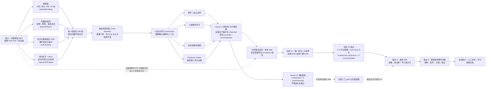

# 端到端多模态识别与通用 Teaching Skill

## 一句话说明项目

系统目标是把一段完整教学视频变成“可执行、可追溯的教学方法”：不仅判断教师在做什么，还要指出判断来自视频的哪一段；随后从多讲中寻找跨课程反复出现的方法，生成一份能用于新教学主题的通用 Teaching Skill。当前 v0 已完成“现有单讲 Skill → 通用 Skill → 参数化九步过程”；原始视频端到 evidence pointer 的 neural v1 也已用模型仲裁弱标注完成真实四模态五折训练，但严格 Skill 物化门禁失败，因此尚未替代 v0。

## 先把两个版本分清

| 版本 | 输入到输出 | 现在的状态 | 答辩时应怎样说 |
|---|---|---|---|
| 启发式 v0 | 已有单讲 Skill → 唯一讲次双门槛共识 → 通用 Skill → 参数化九步过程 | 已实跑，状态为 `heuristic_provisional`；readiness=91.1 | “我先用真实 2×5 讲完成了闭环；91.1 是内部就绪度，不是准确率。” |
| 神经 v1 | 原始 MP4 → 四模态 backbone → 融合与长时序 → 有证据的单讲 Skill → 通用 Skill | 10 讲真实五折训练与真实性审计已完成；54 个 OOF 原子全部 uncertain，严格物化失败 | “模型确实训练了，但弱标签开发结果没有通过 observed 门槛；我保留失败结果，不把候选说成最终 Skill。” |

特别注意：项目包含两条不同的真实链路。答辩 Demo 的工程链运行官方字幕/ASR、音频静音、Tesseract OCR、画面变化和 CLIP 视觉语义，再由规则生成候选事件；neural v1 则实际运行冻结的 VideoMAE、WavLM、XLM-R、LayoutLMv3，训练融合/长时序/多任务头。后者已经训练完成，但没有建立人工 gold Accuracy、确认性多模态增益或最终 Skill 可用性。

## 完整框架图



图中 VideoMAE 等主干已在 neural v1 中真实运行；当前答辩可用闭环仍由 v0 从节点 H 的 10 份既有单讲 Skill 开始。最重要的不是四个模型名字，而是两道约束：

1. **证据约束**：标签必须能指回原视频的具体时间段；
2. **来源约束**：视频中观察到的步骤和系统建议补全的步骤必须分开。

## 每个模态到底提供什么

| 模态 | neural v1 backbone | 主要解决的问题 | 单独做不到的事 |
|---|---|---|---|
| 视频 | VideoMAE-Base | 教师/画面动作、板书变化、演示节奏 | 看不到的动作不能推断；不能仅凭画面理解完整教学意图 |
| 音频 | WavLM-Base+ | 停顿、语气、节奏、提问后的等待 | 不等于字幕内容正确；不做人声身份识别 |
| 字幕/ASR | XLM-R-Base | 提问、解释、举例、纠错等语言语义 | 只能知道“说了什么”，不一定知道画面上“做了什么” |
| OCR + 布局 | LayoutLMv3-Base | 板书、公式、代码及其空间关系 | OCR 错字会传递噪声；引擎置信度不是本数据上的准确率 |

四个 backbone 的输出不能直接拼成 Skill。它们先投影到同一维度、按时间戳对齐，再由 cross-attention 学习“此时教师说的话、声音、画面和板书是否互相支持”。长时序模块继续判断：这是一个孤立动作，还是“引例 → 抽象 → 推导 → 检查”的教学过程。

## Neural v1 中什么叫 evidence pointer

假设模型判断 12:20–12:55 是“用直观例子建立概念”。普通分类器只给一个标签和分数；本方法还要求输出：

```text
标签：intuitive_example
时间：12:20–12:55
字幕证据：12:24–12:41 的举例说明
视觉证据：12:29 的示意图/板书片段
媒体绑定：video_sha256 + frame/segment id
```

只有同时满足“标签置信达到门槛、证据指针达到门槛、时间戳和媒体哈希一致”，该步骤才叫 `observed_method`。否则系统选择 `uncertain_observation`。这不是保守过度，而是防止系统为了凑齐九个环节而编造教师行为。

## 单讲 Skill 和通用 Skill 有什么关系

单讲 Skill 回答：“这一讲的教师实际上怎么教？”

通用 Skill 回答：“多门课反复支持了哪些方法，把它们迁移到新主题时该怎么执行？”

二者之间不是另一个黑盒生成器，而是可复算的唯一讲次二元投票。对方法 $q$，每个唯一 `(course, lesson)` 最多投 1 票；同一讲重复出现不重复计数：

$$
s(q)=\frac{1}{N}\sum_{i=1}^{N}v_i(q),\qquad
s_c(q)=\frac{1}{n_c}\sum_{i:c_i=c}v_i(q).
$$

只有同时满足总体 $s(q)\ge0.80$，而且**每一门课**都有 $s_c(q)\ge0.60$，才算 observed 共识。小白理解：10 讲中至少要有 8 讲支持，同时不能只靠一门课撑起来；每门课自己的支持率也必须至少 60%。

现有 2 门课程 × 5 讲的输入统计中，推导/操作、直观例子、前置复习均在 10/10 讲出现；抽象概念与理解检查各为 8/10；错误纠正为 7/10；练习反馈与问题设置各为 4/10；总结迁移为 1/10。它说明哪些方法在当前样本中反复出现，不说明系统识别这些方法的 Accuracy。

### 当前 v0 怎样区分“观察到”和“建议补全”

| 当前 v0 内容 | 数量 | 来源语义 |
|---|---|---|
| 主策略 | 6 个 | 全部通过总体 0.80 + 每课 0.60 双门槛 |
| `cross_lecture_observed_consensus` phase | 5 个 | 前置复习、直观例子、抽象概念、推导/操作、理解检查 |
| `recommended_enrichment` phase | 4 个 | 问题设置、错误纠正、练习反馈、总结迁移；仍保留真实支持计数，但未过双门槛 |
| procedure 顺序 | canonical 九环节 | 为新任务执行采用的控制策略，不是多讲 observed pairwise 顺序 |

当前 v0 **没有**物化 `observed_consensus_graph` 的 pairwise edge，也没有声称十位讲次都采用同一真实顺序；真实顺序留在 10 份单讲 Skill 各自的 procedure 中。neural v1 已实现 observed graph 与 recommended flow 的双图契约，但本轮 observed graph 因置信门槛未通过而为空，九个环节全部留在 recommended flow；这正是结构审计失败的原因之一。

## v0 怎样蒸馏出一份可用于下一题的通用 Skill

当前可执行 v0 采用以下确定性规则：

1. 输入至少 2 门课程、每门至少 5 份通过 Schema 的单讲 Skill；
2. 对每份 Skill 计算 canonical JSON SHA-256，把真实标识转为 `course_ref/lesson_ref`，再对完整脱敏来源记录数组计算集合 SHA-256；
3. 拒绝重复 `(course_id, video_id)`；每个唯一讲次对一个节点最多投 1 票；
4. 只统计 `origin=observed_method`，要求总体支持率≥0.80 且每门课支持率均≥0.60；
5. 策略只保留通过双门槛的 6 个；
6. 九个 phase 均进入 canonical procedure：5 个通过者标 `cross_lecture_observed_consensus`，4 个未通过者标 `recommended_enrichment`；
7. 按 canonical 九环节顺序填写 trigger、preconditions、goal、teacher actions、student signals、fallback 和 verification；不生成 pairwise observed-order graph；
8. 输出通用 Skill、来源 receipt 和内部 readiness 审计。当前 readiness 为 91.1，明确不是 Accuracy。

通用 Skill 不复制字幕原文、OCR、私有路径或帧，只保存输入 Skill 指纹和聚合支持。这样可公开检查来源承诺，又不会泄露私有课堂数据。

## 在下一题上如何用

输入：

```yaml
concept: 动态规划
learner_level: 初学者
```

当前执行器做的是把 `concept` 与 `learner_level` 注入通用 Skill，生成参数化的 canonical 九步过程，并保留每步的 expected signal 与 fallback；它不会自动补写完整的动态规划专业知识。下面是**上层学科 Agent 可继续填充的示意**，不是当前执行器的逐字输出：

```yaml
goal: 让学生从具体重复子问题过渡到状态、转移和边界条件
procedure:
  - phase: prior_knowledge_review
    teacher_action: 检查学生是否理解递归与子问题
    expected_signal: 能指出递归函数的输入和返回值
    fallback: 用一个两层递归树重新解释
  - phase: intuitive_example
    teacher_action: 用爬楼梯问题画出重复子问题
    expected_signal: 能圈出被重复计算的节点
    fallback: 先只展开到第三层
  - phase: abstract_concept_building
    teacher_action: 抽象出状态、转移、初始条件
    expected_signal: 能用自己的话解释 dp[i]
    fallback: 回到每个数组元素代表什么
  - phase: derivation_or_operation_walkthrough
    teacher_action: 逐行写出递推式和代码
    expected_signal: 能预测下一行的作用
    fallback: 隐去一行让学生补全
verification:
  - 一道结构相同但背景不同的迁移题
  - 一道错误状态定义的判断题
```

这一步叫“Skill 执行”，不是“重新识别视频”。当前执行器只完成参数替换与九步过程生成，把 expected signal 和 fallback 交给后续运行时 Agent；“爬楼梯、状态转移、递归树”等具体内容需要上层学科 Agent 或教师继续填写。

## 自动评估能评什么，不能评什么

| 自动检查 | 它真正说明什么 | 它不说明什么 |
|---|---|---|
| Schema 是否通过 | 字段可被 Agent 读取 | 教学一定优秀 |
| observed 是否都有 evidence | 引用完整、来源可追溯 | 标签一定正确；仍需人工 gold |
| 来源 SHA-256 是否可复算 | 没有悄悄更换输入 Skill | 输入数据本身没有偏差 |
| 占位符是否全部替换 | 能在新主题执行 | 学生一定学会 |
| 每步是否有 signal/fallback | 运行逻辑完整 | fallback 对真实学生一定有效 |
| 唯一讲次总体/逐课程支持率 | 当前 10 讲是否通过 0.80/0.60 双门槛 | 识别 Accuracy 或跨学校泛化 |
| readiness 91.1 | Schema、来源、共识、执行、隐私和哈希就绪度 | 91.1% 识别准确率或教学效果 |

neural v1 的确认性主指标是 `evidence-grounded method Macro-F1`：环节/策略标签正确，而且证据时间段与人工最小充分证据 IoU 至少为 0.5，才算一次正确预测。还必须报告事件 F1/mAP、环节 segmental F1、策略 AUPRC、Evidence Recall@K、校准误差和 unsupported observed rate。

预注册的中心假设是：在完整课程留出的外部锁箱上，Full neural v1 相比 FLOP-matched transcript-only，主指标至少提高 5 个百分点，且按完整讲次聚类的 95% 置信区间下界大于 0。若没有达到，就应明确说“尚未建立多模态增益”，不能换成 Hamming accuracy 或内部 overall。

## neural v1 可信发布还差什么

1. 为现有 10 讲建立双人独立的事件、九环节、策略和最小 evidence gold；当前的 A/B/仲裁均是模型弱标注；
2. 一致性不达门槛时修订标注手册并重新标注，而不是直接仲裁成看似完美；
3. 新增至少两门课各 5 讲：一门 validation，一门一次性 test；
4. 在人工 gold 上解决 phase collapse 与 pointer 区分能力，再冻结 split、指标、seed 和阈值；
5. 做 Text / +Audio / +Visual-OCR / Full、FLOP-matched Text 和 Late fusion 对照；
6. 只有 strict materialization audit 通过，才把 neural v1 候选升级为正式通用 Skill；
7. 用盲法专家评分验证 Skill 质量；若要说提升学习效果，另做伦理审批后的学习者实验。

## 答辩时可以这样讲

### 30 秒版本

> 我的系统不是把视频直接交给大模型写总结，而是先形成每讲有来源证据的 Skill。当前可用 v0 对两门课各 5 讲做唯一讲次二元投票，得到 6 个共识策略和九步过程，其中 5 步是 observed、4 步是 recommended。进一步的 neural v1 已对 10 个完整视频运行四个 backbone 并完成五折训练，但 54 个 OOF 原子全部是 uncertain，严格 Skill 审计没有通过，所以我没有把训练完成说成最终 Skill 完成。readiness 91.1 与弱标签 F1 都不是部署准确率。

### 老师追问“你到底融合了吗？”

> 融合做了，而且分两层。答辩 Demo 是时间对齐后的规则级融合；neural v1 另把 VideoMAE、WavLM、XLM-R、LayoutLMv3 表示投影到 256 维，用质量门控的局部 cross-attention 融合，再用 6 层长时序 Transformer 训练。模型训练是真实的，但当前弱标签 OOF 诊断较低、严格 Skill 门禁失败，所以还不能说已建立可靠多模态识别或多模态增益。

### 老师追问“通用 Skill 会不会只是九步模板？”

> 当前 v0 还没有 pairwise observed-order 图。它采用 canonical 九步作为执行策略，但逐步标明 5 个跨讲 observed consensus 和 4 个 recommended enrichment，并保留总体、逐课程支持计数和来源 Skill 指纹；10 个单讲的真实顺序仍在各自 Skill 里。neural v1 已实现 observed graph 与 recommended flow 的结构，但本轮 observed graph 是空的，因此候选没有通过发布门禁。

### 老师追问“自动评分是不是准确率？”

> 不是。当前通用 Skill readiness 是 91.1，只检查 Schema、输入多样性、共识支持、canonical 可执行性、隐私和哈希来源。真正的识别准确性要靠双人标注的事件/环节/策略/evidence gold，用 Macro-F1、segmental F1 和 Evidence Recall 来评；学习效果还要单独做学生实验。

## 最后必须坚持的声明边界

- 可以说：启发式 v0 已形成可执行、可追溯的通用 Skill；neural v1 已完成真实四模态五折训练与真实性审计。
- 可以说：当前真实视频链已运行字幕、音频、OCR、画面变化和 CLIP 特征。
- 可以说：冻结的 VideoMAE/WavLM/XLM-R/LayoutLMv3 已实际提取特征，融合/时序/多任务头已训练。
- 不可以说：Schema 合法的 neural v1 诊断候选就是最终可信 Skill；它的严格结构门禁实际为失败。
- 不可以说：现有内部分数就是 Accuracy，或已达到部署 0.9。
- 不可以说：两门课的共识已经证明跨学校通用。
- 不可以说：自动生成的教学过程已经证明提高学生成绩。

正式方法、损失、数据划分、消融和失败规则见 [`runs/e2e_general_skill_v1/stage2_method/method.md`](../runs/e2e_general_skill_v1/stage2_method/method.md) 与 [`experiment_plan.yaml`](../runs/e2e_general_skill_v1/stage2_method/experiment_plan.yaml)。
