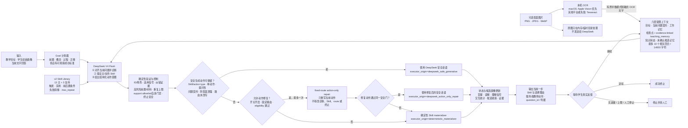

# 题目二：基于 Teaching Skill Library 的自适应教学 Agent

边界提醒：学生“确认识别文字”只确认转写，确认不等于答案正确。

## 1. 问题定义与当前结论

题目二要求的不是一次性生成整段教案，而是一个实时的多轮闭环：系统收到一个教学目标和学生初始状态，只生成当前一步；学生回答后，系统重新判断状态、选择或组合 Teaching Skill，再生成下一步，直到达标或安全转人工。

当前仓库已经实现这一工程闭环。`deepseek-v4-flash` 负责语义理解、问题对齐诊断、Skill 路由和当前教师动作候选；确定性控制器负责状态边界、Skill 合法性、重复上限、一次一动作和终止条件。默认 `safe_generative` 执行器只在模型话语与最终 Skill 的 `action_type`、单动作、提问性、问题契约和防答案泄露规则全部一致，且主/支持 Skill 未被控制器改写时保留该话语。若只是不满足动作契约且固定路由修复门禁通过，生产入口最多追加一次只重写当前动作的 action-only repair；未启用、不适用或修复仍失败时，才使用服务端确定性 materializer。三者共同构成一个受约束 Agent，不能把它简化成“只调用一次大模型”，也不能把规则层说成另一个模型。

| 题目要求 | 当前实现 | 可验证状态 |
|---|---|---|
| 新教学目标与成功条件 | 概念、目标、材料、四维阈值、最大轮数；自动展开为 4 个可观察子目标 | 已实现并有单测 |
| 学生画像 | 三个合成初始画像可整组切换水平、掌握、偏好与未标注背景；每个有效 DeepSeek 回合追加带证据的候选观察和摘要 | 已实现并有会话隔离测试；`background_history` 不作为学情标签，头像不对应真人、不参与能力判断 |
| 学生当前状态 | 四维掌握、误解生命周期、当前理解信号、下一关注点、置信度、证据和交互统计 | 已实现并逐轮更新 |
| 历史对话 | 六层 `teaching_context`：固定锚点、当前计划、近期工作记忆、较早历史的统计/证据检查点/可重放 `teaching_memory`、知识状态和未确认候选记忆 | 已实现并有预算、证据来源和 replay 测试；不是完整历史语义总结、无限记忆或不同 session 的自动合并 |
| Skill 选择、组合与切换 | 13 个主 Skill 中选 1 个，可组合最多 2 个支持 Skill；主 Skill 的 `supporting_skill_ids` 是硬组合 allowlist，support 还须通过自身门禁；每轮重新决策并公开理由 | 已实现；开放场景最优性待专家验证 |
| 实时交互 | 一次请求只消费一条学生回答，只返回一个下一教学动作 | 已实现；不是预写好多轮对话 |
| 答案图片证据 | 学生可提交文字、答案图片或两者；原图经本机多预处理/多 OCR 路由后，只把有界、模式脱敏的文字证据并入当前回答 | 已实现并有单元、HTTP 和 image-only Chrome 验收；可靠公式转写与公式正确性分开，手写/公式及判分部署准确率未建立 |
| 终止 | 成功、连续无进展、最大轮数、受约束模型建议或教师 `/stop` | 已实现并有安全门 |
| 评估 | 28 例单轮自由文本开发 benchmark、20 episode/65 个学生回答回合（另含 1 次画像替换操作）多轮对抗开发集、4 例结构化机制回归、学习结果记录接口 | 已实现评估管线；多轮 fixture 尚无公开在线数值，四类证据的含义不能混用 |

## 2. 系统整体设计



一轮的输入与输出边界如下：

```text
输入：目标 + 初始画像 + 当前显式状态 + 相关历史 + 本轮文字回答/本地 OCR 文字证据 + 可用 Skill
  图片支路：答案原图 → 本机 OCR → 长度约束与常见直接标识符模式替换 → teaching_context
             原图、缩略图、本机路径和临时文件不进入 DeepSeek 请求
  ↓
DeepSeek：受约束的“诊断—路由—动作意图”JSON 建议
  ↓
控制器：校验证据与 Skill、更新状态与候选画像、判断是否终止
  ↓
Skill Runtime：安全模型动作通过全部门禁则保留；仅动作不匹配时可做至多一次固定路由修复；未通过则按选中 Skill 契约确定性物化
  ↓
输出：一个主 Skill、0–2 个支持 Skill、选择理由、一个教师动作、期待信号
```

因此，“实时”在本项目中指学生每回答一次，后端才计算一次下一步；浏览器不会提前得到后续完整对话。学生可以提交文字、答案图片或两者。答案图片不是直接交给 DeepSeek：服务端先校验格式和大小，在本机临时目录生成原图、灰度增强和高对比度二值等有界 OCR 路线；受支持的 macOS 主机优先调用 Apple Vision，并在需要交叉核对时运行 Tesseract，其他平台在安装 Tesseract 后使用 Tesseract。OCR 文本最多保留有界长度，并与普通学生文字一起经过常见直接标识符模式替换后进入 `teaching_context`；原图及派生图随后删除且不会发送给远程模型。这是 OCR 辅助的文本证据链，不是 DeepSeek 原生图像理解，也不表示流式摄像头或实时音视频识别。

OCR 链路把“转写可靠”与“答案正确”严格分开。高置信、无实质冲突且由多引擎或足够多独立预处理路线一致支持的公式，可写入 `formula_transcription_established=true` 并免去“请先抄写公式”的确认；`formula_accuracy_established` 仍固定为 `false`。只有可靠转写与当前 `question_contract` 中可判定的短概念/公式答案，或教师 `knowledge_spec` 中可建立正确性的规范陈述精确匹配时，控制器才能确定性判对。证据绑定允许空格、答案前缀、句末标点、等价乘除号，以及单个等式左右两侧交换这类可解释的排版差异，但不做模糊拼写修复、任意代数化简或运算符猜测；绑定后仍返回本机 OCR 原文。开放解释题中仅出现相关词、或只命中 rubric 的一块可接受证据，都不自动等于完整正确。低置信、无文字、OCR 路线冲突、键入/OCR 冲突，或公式缺少可靠转写佐证时仍要求学生确认。当前高对比度印刷文字可用于演示链路；手写、复杂版面、公式 OCR 和答案判分的部署准确率都没有建立。

## 3. DeepSeek 在 Agent 中具体做什么

`deepseek-v4-flash` 每轮只接收一个经过最小化和校验的 `teaching_context`，以及有界的 Skill 执行契约。若本轮含答案图片，模型看到的是标有 OCR 状态、转写置信度、多路线佐证和“是否需学生确认”的 `[LOCAL_VISUAL_EVIDENCE]` 文字包络，不是原图；低置信、无文字、路线/键入冲突或未获佐证的公式证据必须保守请求确认。首轮在发送前只保留允许 `not_observed` 的主 Skill 与支持 Skill，避免在没有学生回答时跳过诊断门禁；普通回合发送会话内允许的 Library（可能是 `allowed_skill_ids` 生成的主 Skill 子集加全部 support），由模型提出候选，再由确定性控制器按本轮 Skill ID/角色、`applicable_signals`、纠错证据、高风险阶段/材料前置条件、材料存在性、`max_repeat`、主 Skill 的 support allowlist 及 support 自身门禁做最终校验或安全改路。该上下文把固定目标、教师画像、当前 Goal 步骤、当前问题契约、近期对话、较早历史检查点与 teaching memory、显式学生状态和未确认画像假设分层组织，再返回严格 JSON：

- `diagnosis`：`correct / partial / misconception / confused / no_response`，以及相对本问的 `answer_alignment`、匹配/缺失概念、置信度、短证据、误解标签、回答质量、参与度和是否建议人工复核；
- `decision`：一个主 Skill、最多两个支持 Skill、选择或切换理由、下一关注维度；
- `teacher_action`：模型给出结构化当前动作。默认 `safe_generative` 模式会校验 Skill action type、单动作、提问性、问题契约、内容安全与答案泄露；全部通过且路由/support 未被改写时保留 `message / expected_signal / question_contract`。仅动作候选不匹配、修复开关开启且 eligibility 通过时，系统最多再请求一次不能改诊断、Skill、route 或终止的 fixed-route action-only repair；修复不适用或仍未通过时，由服务端按最终 Skill 确定性重建，再绑定 `question_id`；
- `stop_recommendation`：是否建议停止及理由。

模型没有以下权限：新增不存在的 Skill、选择 support Skill 充当主 Skill、组合主 Skill 未在 `supporting_skill_ids` 中声明的 support、绕过 support 自身门禁、超过 Skill 的 `max_repeat`、重写历史、直接改变终止状态，或一次生成多轮教学。模型 message 不是无条件直出：`action_provenance.executor_origin=deepseek_safe_generative` 表示首个安全候选通过动作门禁，`deepseek_action_only_repair` 表示固定诊断与路由后的一次动作修复通过，`deterministic_materializer` 表示修复未启用、不适用或仍失败后使用本地重建。三种路径都要再通过防答案泄露与 Session 校验。

视觉证据确认是独立于模型判断的硬合同。附件低于转写置信阈值、未识别出文字、OCR 路线出现实质冲突、键入文本与 OCR 冲突，或公式样表达没有满足多路线佐证时，学生附带“答案见图”“照片这样显然是对的”等空泛文字也不能把它变成已确认答案。控制器把该轮固定为 `partial / ambiguous`、置信度 `0.0`，不增加任何掌握维度、不解除误解，且不保留模型声称但未执行的 support / `support_execution`。确认动作只允许使用 `skill_self_explanation` 或 `skill_socratic_understanding_check`：优先执行自我解释，触及其连续 `max_repeat` 后切换到苏格拉底理解检查，后续再按两者各自门禁和重复上限契约式轮换；下一动作始终只要求学生用自己的话确认或修正关键概念、符号或第一步。即使模型 JSON 无效并进入 `deterministic_safety_fallback`，同一轮换合同仍然生效。相反，已建立可靠转写且精确命中教师问题契约或知识规格的图片答案可以确定性判对，但这仍不把 OCR 引擎置信度解释为公式正确率。

“确认识别文字”或输入修订只满足附件消费前的学生确认门：它证明学生对本机转写文本作了确认/修订，不等于系统已经验证答案正确，也不会把 `formula_accuracy_established` 改为 true。只有后续可靠文字证据精确命中当前问题契约或教师知识规格时，服务端才可能产生 `active_question_contract_exact_match` / `teacher_knowledge_spec_exact_match`；其中 canonical claim 必须带非空 `knowledge_components` 并与当前动作知识点相交，未绑定知识点的 claim 只能作为模型参考。多行 OCR 必须整体匹配，不能把单独一行当成完整答案；若完整命中相邻知识点的教师 claim，系统会记为 `partial / related_but_not_answer`，而不是当前问题答对。

产品运行和开发 benchmark 现在复用同一份诊断标签定义。只有直接满足当前问题判据才是 `correct / aligned`；相关但没有回答本问是 `partial / related_but_not_answer`；明确表示“不知道、没懂、分不清”才是 `confused`；只有可定位的错误命题才能写入 `misconception`。因此“保存已经算过的结果叫什么？”这一问中，“状态转移方程”是相关线索但不是“记忆化/缓存”的直接答案，应判部分对齐并继续澄清，而不是强行算正确或据此断言学生整体困惑。

若 API、格式或校验失败，默认进入可见的确定性安全降级：空回答记为 `no_response`；明确自报“不知道、没懂、分不清”等困惑时可记为 `confused`；其余非空回答保守记为待复核的 `partial`，不凭规则臆造误解。动作标记为 `decision_origin=deterministic_safety_fallback`。这个结果不是 DeepSeek 结果；只有页面显示 DeepSeek 来源时，才能称该轮使用了模型诊断。

诊断证据还单独记录 `assessment_source`，页面按以下来源分类展示，避免把控制器修正或规则回退混成“模型原判”：

| 来源 | 含义 | 可否称为原始模型诊断 |
|---|---|---|
| `deepseek_v4_flash` | 模型输出通过问题、证据和标签契约，未发生确定性归一化 | 可以，但仍是未建立部署准确率的模型判断 |
| `deepseek_v4_flash_constrained_by_deterministic_contract` | 模型完成诊断，但控制器因问题对齐、置信度、误解证据或其他契约要求修正了最终标签/属性 | 不可以；应称“模型诊断经契约修正” |
| `active_question_contract_exact_match` | 当前可靠文字证据精确命中服务端绑定、且可确定性判分的短概念或 worked-step 公式答案，契约结果覆盖内部不一致的模型标签 | 不可以；应称“本问契约精确命中”，并保留原始模型标签供审计 |
| `teacher_knowledge_spec_exact_match` | 当前可靠文字证据精确命中教师 `knowledge_spec` 中标记为可建立正确性的规范陈述 | 不可以；应称“教师知识规格精确命中”；内置演示规格仍是作者构造 fixture，不是外部专家 gold |
| `deterministic_safety_fallback` | API、构建、格式或校验失败后的规则安全信号 | 不可以；它不是自由文本理解结果，也不会生成候选画像 |

## 4. 学生状态、候选画像与历史怎样维护

### 4.1 显式状态

系统每轮都保存至少题目要求的四类信息：

| 状态组 | 字段与含义 |
|---|---|
| 当前掌握情况 | `knowledge_mastery`：`prerequisite`、`conceptual`、`procedural`、`transfer` 四维内部控制值 |
| 误解或错误模式 | `misconceptions`：误解标签、描述、置信度、发现轮次以及 `active/resolved` 状态 |
| 当前理解信号 | `understanding_signal`、`assessment_confidence`、`assessment_evidence` |
| 下一教学重点 | `next_focus`：关注维度、理由和对应 Skill |
| 交互信号 | 尝试次数、各信号计数、滚动正确率、平均回答长度、参与度和回答质量 |

回答产生的动态信息进入可审计的 `student_state`。掌握值是控制状态，不是考试成绩，也不是经校准的真实掌握概率。

### 4.2 动态学生画像候选

教师提供的 `learner_level`、`preferences` 和 `accessibility_needs` 是基础画像，Agent 不会覆盖这些字段。每个通过 JSON、Skill 和证据校验的 DeepSeek 回合，系统会在 `student_profile.adaptive_observations` 追加一条动态候选，内容包括：

- 本轮回答质量和参与度；
- 候选误解标签与下一关注维度；
- 与本轮已脱敏回答绑定的证据摘录和诊断置信度；
- 是否需要人工复核及原因。

每条记录固定为 `status=candidate_unconfirmed`。`adaptive_summary` 汇总最新回答质量、参与度、下一重点、候选误解标签、累计/保留观察数和复核状态；最多保留最近 12 条观察，总观察数继续累计。低于运行时置信度门槛（默认 0.35）、模型主动请求复核，或没有可绑定到本轮学生原话的证据摘录时，都会标记 `needs_human_review=true`；最后一种情况同时记录 `review_reasons=no_grounded_excerpt`，不能当成已有证据支持的画像事实。

只有经过约束层验证的 DeepSeek 诊断才产生候选；初始动作和 `deterministic_safety_fallback` 都不会生成。候选证据在保存前已做常见直接标识符模式替换；非空摘录必须是本轮脱敏回答的真实子串。模型伪造摘录时不会用整段学生回答替换，而是清空摘录；若模型试图在无绑定证据时给出 `correct` 或 `misconception` 这类高影响标签，系统会降为待复核的 `partial`，清除误解标签并拒绝误解除标。后续请求只把最近候选作为明确标记的 `candidate_unconfirmed` 低权重假设，不能当作已知事实，也不能覆盖教师画像。

这个设计实现了“随回答更新画像”，同时保留人工最终解释权：候选观察不是已确认人格或能力事实，也不会自动合并到另一个 session 形成跨学生长期画像。默认 Session 只存在于本机服务进程内；只有操作者显式传入 `--session-store` 时，同一 Session 的候选观察才会随其他会话状态写入本机私有 JSONL，并在严格恢复门禁通过后冷恢复。

### 4.3 Goal 模式

目标计划器把一个目标确定性地展开为 4 个可观察步骤：前置知识、概念理解、操作/推导和迁移。每一步包含目标、验证方式、成功判据和阈值；状态变化后同步更新 `active_step` 与进度。该进度用于控制教学流程，不是学习效果证据。

### 4.4 上下文管理

远程请求不会无界发送整个会话，也不再把 goal、state、history 和 profile 作为互相重叠的散装字段并列发送。唯一权威 `teaching_context` 分为六层：

1. `fixed_context`：教师输入的目标与基础画像，模型不可改写；
2. `current_plan`：当前 Goal 步骤、成功判据、上一教师动作及其问题契约；
3. `working_memory`：本轮回答以及默认最多 10 个相关回合；
4. `semantic_summary`：较早历史的确定性计数、focus checkpoints、最多 6 条 evidence-linked `teaching_checkpoints`，以及由完整 rollout 确定性 replay 得到的 `teaching_memory`。后者只保存学生明确偏好、未解决问题、教师承诺和可供“第二种呢”等表达指回的对象；每项绑定原始 learner/teacher utterance，记录 `history_version`、`compaction_generation` 与固定目标/画像指纹，不调用模型编写叙事摘要；
5. `knowledge_state`：四维掌握、活跃/已解决误解和未解决问题；
6. `candidate_long_term_memory`：最近的未确认画像假设，明确低权重且不可覆盖教师字段。

网页中的“既往上下文（未标注）”按换行拆分为 `student_profile.background_history`，与带 `signal + focus_dimension` 的结构化 `conversation_history` 明确分开。构建上下文时，每条背景只以 `label_status=unlabeled_background_not_state_evidence` 和来源 `teacher_provided_unlabeled_background` 进入 `unlabeled_notes`；`unlabeled_notes_may_update_state=false`。因此它可以帮助模型理解教师提供的先验背景，但不会在会话开始时伪造 `partial/confused` 等学生信号，也不会直接改变四维初始掌握、当前理解信号或误解生命周期。

检索顺序仍为“同知识点优先、同关注维度其次、最近轮次最后”。未填写知识点时，使用教师输入的 `goal.concept` 作为最小真实锚点；填写多个有序知识点时，每个动作只携带文字命中或与当前掌握阶段对应的活动知识点，不再把整份目标复制到所有回合。`teaching_checkpoints` 可以保留尚未清除的困难、学生明确问题/偏好、已验证前置知识或教师明确下一步，但未知的解决/完成状态不会由模型补写；`teaching_memory` 同样只能由显式原话与状态转换更新，且可从完整历史重新构建并核验内容哈希。`teaching_checkpoints_are_selective_extracts=true` 且 `omitted_turn_semantics_are_exhaustive=false`，因此统计上记录了省略轮次不等于完整保留其语义。默认总序列化硬上限为 14,000 字符，可配置为 6,000–30,000；近期窗口默认 10 回合，可配置为 0–12。每个快照记录实际保留轮次、字符数、截断状态和证据来源。合法超长会话会先丢弃低优先级候选、检查点和较旧回合，最终仍生成 schema-valid 的最小请求；若构建器本身异常则进入明确的规则安全降级。本轮学生回答只出现一次，证据账本保存的是指针，避免重复占用预算。

发送前会最小化画像字段，并对常见邮箱、手机号、中国身份证号、URL 和本机路径模式做替换，真实媒体不会发送。`contains_direct_identity=true` 或非 JSON 布尔值会在任何远程调用前 fail-closed。但系统无法仅靠模式规则证明自然语言姓名、学校或普通学号已全部识别，因此 trace 明确记录 `raw_identity_fields_sent=not_established`、`residual_identity_risk=true`。这里应称“常见直接标识符模式脱敏与上下文最小化”，不能承诺所有自由文本都已完全匿名；使用远程 API 前仍须取得授权，并避免输入不必要的个人信息。

连续性不是让模型凭印象补历史。对“第二种呢”“回到第 1 轮”“按最开始的方式”“重新解释刚才那个点”“按约定继续”等显式 cue，服务端确定性生成 `semantic_summary.continuity_recall`：`resolved_evidence_linked` 只能依据 `target.excerpt` 与 `evidence_refs` 接续；`unresolved_no_matching_evidence` 必须承认没有匹配记录并请学生重述。action-only repair 只接收有界、脱敏、证据链接的 continuity constraints，不能另造历史或改变路由、诊断和终止。

### 4.5 会话生命周期与 Codex 参考

本项目没有复制 Codex，也没有把 Shell、Git、沙箱或多 Agent 能力混入教学系统；参考的是官方开源 Codex 固定版本 `15ea598c6e7e0914a7ae8c881ac05dacea2f7902` 中 thread/turn identity、预期轮次核验、陈旧异步结果隔离、追加式事件和 running/cold-resume 等可靠性模式。Teaching Session 对应 thread，教学回合对应 turn。当前网页、请求协议、教学上下文、状态机和视觉样式均为本项目原创实现，不声称复刻或迁移 Codex UI。

start、step 与 command 都有各自的幂等键；step/command 还必须同时匹配 `session_id + expected_round + expected_question_id + expected_context_version + profile_revision`。逐 Session 锁串行化同一会话的变更，`context_version` 在成功提交后递增，重放同一请求返回缓存，冲突键、旧问题、旧轮次、旧上下文或旧画像版本都 fail-closed。前端在应用 start/step/command/attachment 等异步响应前还核对发起请求的 epoch/token、返回 `session_id`、`profile_revision` 与不倒退的 `context_version`；慢响应不能把已经切换的画像或已经推进的回合覆盖回旧快照。请求 body 指纹与有界响应缓存、画像 prepare-then-commit、16 槽注册表、六层教学上下文、问题契约和这些客户端 guard 都是本项目实现。

画像切换不是原地改写旧学生，而是 prepare-then-commit：服务先校验请求，完整构造新首轮并通过结构、Skill 与 Session 校验，随后才在注册表临界区提交新 Session、退休被替换会话并写入 start 幂等缓存。DeepSeek 失败不必然等于切换失败；若醒目标记的 `deterministic_safety_fallback` 也通过全部校验，它可以合法建立新画像 Session，否则没有合法候选时才保留旧会话。若页面持有的 replacement guards 已因 UI 外的同 Session 推进而陈旧，第一次 start 会按预期 400 拒绝；前端只允许调用一次 `api/session` 同步权威 guards，废弃旧 start 幂等键并用新键重试一次，第二次仍冲突则停止而非循环。Playwright runner 已主动制造并检查了这一受控路径。

默认不启用磁盘持久化：刷新页面时，浏览器只从 `sessionStorage` 取回随机、无业务语义的 opaque session handle，再向同一进程内的服务端状态恢复；进程结束后旧 handle 失效。只有显式传入 `--session-store <path>` 时才启用本机追加式 JSONL cold resume。store 为每条事件写入连续 `seq`、`previous_hash` 和自身 SHA-256，完整中间行的篡改或断链会 fail-closed；最后一条未完整写入的截断尾部可在启动时删除。学生 step 先持久化 `turn_started`，成功后写 `turn_committed`，异常写 `turn_aborted`；进程崩溃留下的 started turn 会在重启时补记 recovered abort，同一个旧幂等键不能伪装成已提交，操作者需换新键显式重试。checkpoint 还能恢复 start/step/command/attachment 幂等缓存和最多 16 个隔离 Session。

冷恢复不是“读取 JSON 就继续”。每个 live Session 都绑定不含 API Key 的 `runtime_policy_contract`：provider、model、base origin、thinking/temperature、远程数据授权、prompt version、fallback、support 上限、最低诊断置信度、上下文字符/回合预算和 action executor mode 必须精确一致。API Key 可以轮换，但这些运行政策任一漂移都会拒绝恢复。若会话由 `allowed_skill_ids` 选择主 Skill 子集，恢复校验要求该子集相对当前完整 Library 保持原顺序、逐项内容等价，并保留全部 support Skill；未知、被修改、乱序或缺 support 的 Skill 都不能恢复。store 会在本机持久化会话正文、目标、画像、状态、幂等缓存和尚存附件的受限 OCR 证据，原始图片仍不持久化也不发给 DeepSeek；哈希链提供完整性检测而非加密、身份认证或跨设备同步，因此该文件必须作为私有学生数据保护。

## 5. v2 Teaching Skill Library

默认库为 `data/teacher_agent_skill_library_v2.json`，共 16 个原子 Skill：13 个主 Skill和 3 个支持 Skill。每个 Skill 都定义适用场景、禁用场景、前置与后置条件、失败转移和连续使用上限。

| 角色 | Skill | 主要用途 |
|---|---|---|
| 主 | 前置知识诊断 | 首轮或前置知识证据不足时提问诊断 |
| 主 | 问题情境建立 | 用任务情境说明为什么需要当前概念 |
| 主 | 直观例子桥接 | 困惑时先建立可感知的具体表征 |
| 主 | 直觉—概念映射 | 从例子过渡到正式概念与边界 |
| 主 | 逐步支架推导 | 把复杂过程拆成一个可回答的小步 |
| 主 | 苏格拉底理解检查 | 用追问核验理由，而非只核对结论 |
| 主 | 误解对比纠错 | 对比错误规则与正确边界，定位误解 |
| 主 | 练习—反馈—再练习 | 从支架过渡到独立操作 |
| 主 | 检索式复习 | 需要恢复前置知识或间隔回忆时使用 |
| 主 | 自我解释与反思 | 要求学生解释自己的步骤和依据 |
| 主 | 变式迁移检查 | 在准备充分后测试新情境迁移 |
| 主 | 学习者总结 | 由学生自己概括方法、边界和易错点 |
| 主 | 参与恢复与重新聚焦 | 跑题、参与度下降或持续短回答时恢复互动 |
| 支持 | 提问后等待 | 约束当前动作留出真实回答空间 |
| 支持 | 最小提示 | 只给足以推进一步的提示，避免代做 |
| 支持 | 信心支持 | 在不替代知识教学的前提下降低挫败感 |

其中 12 个 Skill 是 neural-v1 暂定执行本体的操作包装；检索式复习、自我解释、参与恢复和信心支持含有单独标记的同行评审研究补充。研究补充没有被伪装成视频观察结果。

### neural-v1 的真实边界

neural-v1 的来源是 10 讲、2 门课程，采用 grouped 5-fold OOF 开发协议；训练流程使用多模态 backbone，但公开运行 manifest 的证据物化门禁没有通过：

| 字段 | 当前值 |
|---|---:|
| 证据门禁 | `passed=false` |
| 可物化预测 | 0 |
| 被排除预测 | 54 |
| 已确认观察环节 | 0 |
| 已确认跨讲共识策略 | 0 |
| 运行用途 | `provisional_normative_execution_ontology_only` |

因此题目二确实使用 neural-v1 的九环节、十三策略本体来组织运行时 Skill，但只能称为 **provisional 执行本体**，不能称为已确认的课堂观察共识、已建立识别准确率或已证明跨课程泛化。题目一现有 v0 通用 Skill 的展示边界不因此被改写；两者是不同状态的产物。

## 6. Skill 如何选择、组合、切换和终止

每轮模型先提出决策，控制器随后执行硬校验：

生产 dashboard 默认打开 state-first route adjudication。DeepSeek 仍负责语义诊断和候选提议，但状态优先裁决器先依据四维掌握中最先未达阈值的维度、活跃误解、参与度、连续无进展次数和 Skill 执行契约确定优先层；模型候选只在同层 eligible Skill 中 tie-break。手动路由、视觉确认以及已有安全 retarget 不会再次进入该裁决器。Socratic 只有在学生已经提出实质主张、回答与本问对齐、理由或边界仍缺失且上一轮不是 Socratic 时才满足深度检查门，不会成为所有 `partial` 回合的默认 Skill。库级 `LiveAgentOptions` 默认保持开关关闭，以兼容纯函数调用和测试；生产 CLI 在构造 dashboard 时显式开启。

1. 主 Skill 必须来自允许列表且角色不是 `support`；
2. 自动模式下，诊断信号必须落在主 Skill 的 `applicable_signals` 内；纠错 Skill 还必须绑定误解 tag；
3. 若干容易造成阶段越级的高风险条件由本地代码形式化检查，例如具体例子、练习或迁移题材料必须存在，概念映射前应已执行例子，独立练习前应有支架经历，迁移/总结前须达到对应准备线，活跃高置信误解会阻断不合适的后续阶段；
4. 主 Skill 的 `supporting_skill_ids` 是硬组合 allowlist：未声明 support 一律丢弃；声明项仍须确为 `support` 角色，并通过自身的局部前置条件、适用证据和 `max_repeat`，去重后最多保留 2 个；
5. 主 Skill 与 support 都不能超过各自 `max_repeat`；fallback 也不得绕过适用信号、高风险前置条件、材料、allowlist 或重复上限；没有可执行 Skill 时停止并转人工；
6. 输出必须只有一个可响应动作，并明确等待学生；
7. 每轮记录上一 Skill、是否切换、选择理由、模型 trace 和状态证据；
8. 低置信度不会被抬高，也不会把任意非空回答硬改为 `confused`；明确困惑才保留该标签，其余非空不确定回答降为 `partial` 并标记人工复核；
9. 模型建议停止只有同时满足“建议人工复核 + 至少两轮无进展”才会被控制器采纳。

`preconditions`、`contraindications`、`postconditions` 与 `failure_transition` 会完整进入模型请求和审计记录，但自然语言合同并非都能由规则控制器形式化证明。上面列出的是当前机器实际检查的安全关键子集；其他自然语言条件仍用于模型约束和审计，不能把“字段存在”或“模型读到了合同”表述成“系统理解并验证了全部合同”。

控制器还独立处理成功、连续无进展、最大轮数和教师停止。在线模式支持：

- `/+skill 名称`：登记一个持续的主 Skill 锁；若在新建会话时预选，它从第一条学生回答后的路由开始生效，并持续到 `/auto` 或安全门释放；
- `/auto`：恢复自动路由；
- `/stop`：不再消费学生回答，立即停止并建议人工确认。

页面在活动回合中显示的“停止生成”不是同一个命令：它调用 `cancel_turn`，只使当前正在生成的回合失效、保留 Session 以便教师继续；后端用 generation/commit fence 丢弃迟到响应，因此不会增加轮次、历史或画像更新。当前 `transport_cancellation_supported=false`，DeepSeek 的 HTTP 请求可能仍在后台完成并产生供应商计费。只有显式 `/stop` 才把整个 Session 置为 terminal；这两个动作在运行状态和审计事件中分别标记。

人工覆盖不会计为 Agent 自动选择命中，也不能绕过适用信号、纠错证据、重复上限、fallback 和终止约束；控制器拒绝不适用选择时会回到安全 Skill，并在页面显示锁已释放的原因。

## 7. 三层评估证据

三套结果回答的是不同问题，不能合并成一个“总 Accuracy”。

### 7.1 28 例自由文本在线开发 benchmark

最新公开聚合 receipt 来自 2026-08-06 的在线运行，使用 `teacher_agent_free_text_diagnose_route_v3_shared_taxonomy`、`deepseek-v4-flash`、thinking disabled、temperature 0、单次重复。28 个作者构造的一轮中文案例覆盖动态规划、线性代数、Python 和概率；7 类标签各 4 例：`correct`、`partial`、`misconception`、`confused`、`no_response`、`off_topic`、`valid_alternative`。该 benchmark 复用与 live question-contract 相同的 v3 诊断 taxonomy / 语义量表，但它的 prompt 是独立的单轮诊断与路由契约，不是包含分层上下文、状态更新、动作生成和多轮生命周期的完整 live Session prompt；因此这些结果只验证单轮诊断/路由，不等同完整 live Session 评测。

| 指标 | DeepSeek V4 Flash | 对照 / 解释 |
|---|---:|---|
| 7 类信号 Accuracy | 0.892857 | 常量 `partial` 基线 0.142857 |
| 7 类信号 Macro-F1 | 0.875325 | 常量 `partial` 基线 0.035714 |
| 误解标签完全匹配率 | 1.000000 | 只在冻结样例定义下解释 |
| 允许主 Skill 命中率 | 0.750000 | 固定诊断 Skill 为 0.285714 |
| Skill 切换 F1 | 0.787879 | 是否应切换的开发集标签 |
| 终止 F1 | 1.000000 | 是否应终止的开发集标签 |
| 端到端调用失败率 | 0.000000 | 本次 28 次运行 |
| P50 / P95 延迟 | 994.887 / 1250.134 ms | 本次 API 运行环境 |

Gold structured-signal oracle router 的允许 Skill 命中率为 0.964286，但它读取金标准信号，不能与端到端模型作同条件比较。

这 28 例是作者构造、未经专家复核、未在提示词开发后保持独立锁定的 **post-hoc development regression**。所以 0.892857 不能写成“真实学生诊断准确率”，0.750000 不能写成“部署路由准确率”，也不能据此证明完整 live Session 质量或学习效果。公开 receipt 只含聚合值和哈希，不含案例正文、供应商原始响应或密钥。

复现在线 benchmark 需要显式允许远程处理该公开 fixture：

```bash
tsm teacher-agent-benchmark \
  --online \
  --allow-remote-benchmark-data \
  --api-key-file .private/deepseek_api.txt \
  --output artifacts/private/teacher_agent_free_text_benchmark.json
```

### 7.2 20 episode 多轮对抗开发 benchmark

仓库新增 `data/teacher_agent_multiturn_benchmark_v1.json`：20 个作者构造 episode、65 个学生回答回合和 1 次画像替换操作，覆盖长期偏好与未解决问题回忆、“第二种呢”等指代恢复、教师承诺、图片证据确认/精确匹配、知识性错误纠正、Skill 切换、画像替换隔离、跑题恢复、提示注入式索取答案、达标终止和无进展转人工。fixture 至少覆盖 6 个知识主题/类别；每个评分 turn 的 gold 位于独立字段，runner 在构建发给执行器的 blind payload 时递归排除全部 gold key。

runner 可以比较两个执行器，并保留旧名称兼容：`current` 明确是 `LiveAgentOptions(action_executor_mode="deterministic_legacy")` 对照臂；`safe_generative_executor` 精确使用生产默认的 integrated `safe_generative`。V14 state-first 每轮先由 1 次 DeepSeek plan 请求完成诊断、Skill 路由和动作候选，再经过服务端门禁。若候选动作不满足最终路由/动作契约，且 `action_only_repair_enabled=true`、执行器仍是 `safe_generative`、当前已回退为确定性 materializer 并通过 bounded eligibility，候选臂最多追加 1 次 fixed-route action-only repair；视觉确认强制 materializer、legacy 模式等不合格情形不会进入该支路。repair 响应只允许包含 `teacher_action`，不能修改 diagnosis、primary/support Skill、next focus、termination 或 route；任何越权、格式或动作门禁失败都会保留既有确定性动作。传输层重试仍属于相应请求，不形成额外教学动作。报告用 `request_topology` 区分 integrated single-plan 与 one-plan-plus-repair 路径，用 `action_provenance.executor_origin` 区分原始安全候选、action-only repair 和确定性 materializer，并分别记录 `validated_model_plan_count_delta` 与端到端 turn latency；repair 不是第二个 validated plan，latency 也不能单独证明调用次数。报告不保存学生正文、教师话语、prompt 或供应商响应体，只保存逐 episode/turn 哈希、聚合分数和有限审计字段。当前仓库已经验证 fixture、Schema、gold 隔离、失败计数和配对评分逻辑，但本公开文档不填报尚未完成或尚未审核的真实在线运行数值。

请求统计的分母固定为 `completed_committed_turns_only`。`validated_plan_request_total` 是通过计划校验的主 plan 数，`action_repair_request_total` 是实际发起的 action-only repair 数，`logical_model_request_total` 是二者之和；repair 不是第二个 validated plan，却确实是第二个 logical request。报告还分别给出每完成回合均值、repair 发起回合数、采用修复回合数和 `action_repair_adoption_rate`（采用数 / 实际发起数）。失败、取消或未提交的回合不进入这些请求分母，另由完成/失败计数报告；provenance 与计数不一致时验收 fail-closed。

```bash
# 不调用 API：只校验 fixture、Schema 与 gold 隔离入口
python scripts/run_teacher_agent_multiturn_benchmark.py --validate-only

# 获得明确授权后才可运行在线 current；输出必须留在私有目录
python scripts/run_teacher_agent_multiturn_benchmark.py \
  --online \
  --allow-remote-benchmark-data \
  --api-key-file .private/deepseek_api.txt \
  --mode current \
  --output artifacts/private/teacher_agent_multiturn_current.json
```

这 20 个 episode 是作者构造、未经专家复核、未在提示词和执行器开发后锁定的 **adversarial development benchmark**。它不是实人研究，不建立完整 live Session 质量、跨 session 泛化、部署准确率或学习效果；自动测试中的 scripted executor 结果只证明评分器能区分好坏测试双，不是 DeepSeek 成绩。

### 7.3 4 例结构化机制回归

四条合成轨迹使用预先给定的结构化信号，比较动态 Skill Agent 与始终使用 `skill_stepwise_scaffolding` 的固定单 Skill 基线。它检验控制器是否按预期更新和切换，不检验自由文本理解。

| 指标 | 自适应 v2 Agent | 固定单 Skill |
|---|---:|---:|
| 状态轨迹一致率 | 1.000000 | — |
| 允许决策匹配率 | 0.916667 | — |
| 教学行为约束通过率 | 1.000000 | — |
| 使用多个 Skill 的案例率 | 1.000000 | 0.000000 |
| 终止决策匹配率 | 1.000000 | — |
| 内部模拟平均增益 | 37.333250 | 20.416750 |
| 内部模拟增益差 | +16.916500 | — |
| 模拟迁移通过率 | 0.750000 | 0.000000 |

前三例预期成功，第四例预期在持续无进展后安全转人工。内部模拟增益来自状态机，不是真实前后测，也不是因果学习效果。

```bash
tsm teacher-agent-evaluate \
  --library data/teacher_agent_skill_library_v2.json \
  --output artifacts/private/teacher_agent_evaluation.json
```

### 7.4 学习结果记录接口

`teacher-agent-outcome-evaluate` 接受前测、后测、可选迁移测和可选延迟测，计算绝对增益、归一化增益、迁移比例和延迟保持率。输入 provenance 必须明确是作者演示、教师提供记录还是获授权真实学习者记录。

随附 fixture 是作者构造演示：前测 2/5、后测 4/5、迁移 2/3；绝对增益 0.4、归一化增益 0.666667、迁移比例 0.666667。它只证明接口可计算，不证明系统改善了真实学生学习。

```bash
tsm teacher-agent-outcome-evaluate \
  --input data/teacher_agent_learning_outcome_demo.json \
  --output artifacts/private/teacher_agent_learning_report.json
```

## 8. 本机启动与现场演示

### 8.1 配置密钥

密钥不进入仓库。可将外置盘密钥链接到被 `.gitignore` 忽略的本机目录：

```bash
mkdir -p .private
ln -s "/path/to/deepseek_api.txt" .private/deepseek_api.txt
```

也可以不建立链接：双击启动脚本前设置 `DEEPSEEK_API_KEY_FILE`，或直接运行 `tsm` 时设置 `TSM_DEEPSEEK_API_KEY_FILE`。两者都只应指向自己的本机私有密钥文件；密钥只由本机服务读取，不进入页面和公开运行日志。

### 8.2 启动

macOS 直接双击根目录的 `打开题目二教学Agent.command`。等价命令为：

```bash
tsm teacher-agent-dashboard \
  --agent-backend deepseek \
  --model deepseek-v4-flash \
  --api-key-file .private/deepseek_api.txt \
  --allow-remote-student-data

# 可选 cold resume；该 JSONL 含私有会话正文和状态
tsm teacher-agent-dashboard \
  --agent-backend deepseek \
  --model deepseek-v4-flash \
  --api-key-file .private/deepseek_api.txt \
  --allow-remote-student-data \
  --session-store .private/teacher-agent-session.jsonl
```

离线自检和无 API 的规则基线分别为：

```bash
tsm teacher-agent-dashboard --check
tsm teacher-agent-dashboard --agent-backend deterministic
```

页面只绑定 `127.0.0.1`，使用随机 capability URL、CSP 和 `Cache-Control: no-store`。默认只保留有界内存会话；启用 `--session-store` 后，会把会话文本、目标、画像、状态、幂等缓存和尚存附件的受限 OCR 证据写入指定本机 JSONL，原图仍不持久化。哈希链不等于加密或身份认证，因此 store 必须作为私有学生数据保护。浏览器仅保存随机、无业务语义的 opaque 恢复句柄；句柄不含教学正文，但仍可被同源 JavaScript 或 DevTools 读取。页面本地运行不等于全部处理离线：在线模式会把最小化并做常见直接标识符模式替换后的必要文本发送给配置的 DeepSeek API。答案图片原图仅供本机 OCR 临时处理，远程侧只接收长度受限、经过同一模式替换的 OCR 文字包络；图片哈希、OCR 状态和置信度用于本轮审计，原图和临时路径不进入远程请求。低置信、无文字、路线冲突、键入/OCR 冲突或未获交叉佐证的公式会由服务端强制要求学生确认；高置信多路线一致公式只建立转写可靠性，仍需精确命中当前 `question_contract` 或教师 `knowledge_spec` 才能确定性判对。客户端不能靠伪报状态绕过。模型引用多行 OCR 时只允许大小写和空白排版差异，并从原始可信文本回取证据片段。模式替换不能证明任意自然语言身份或 OCR 误识别出的身份信息已完全去除，因此仍需学生/操作者先人工移除姓名、学号、学校、地址等直接标识。网页采用“左侧目标与合成画像—中间学习对话—右侧学情/方法/证据检查器”的工作台；论文评估被放在单独视图，不与学生输入混在一起。同一 attachment/step/command 还会校验会话、预期轮次、问题、上下文版本、画像版本和幂等键，网络重试不会把一次逻辑操作计成两轮，也不能把旧图片绑定到新问题或新画像。

真实浏览器验收额外依赖 Pillow 与 Playwright；仓库提供轻量 extra，不需要安装完整视觉模型栈：

```bash
python3 -m pip install -e '.[browser-test]'
python3 -m playwright install chromium
```

自动验收分为三层。`tests/test_teacher_agent_ui_contract.py` 静态检查 HTML/CSS/JavaScript 的资源、可访问性标记、布局契约和请求字段；`scripts/run_teacher_agent_system_acceptance.py` 调用页面使用的同一组 loopback HTTP API，黑箱覆盖 bootstrap、start/resume/step、失败替换保留旧会话、成功替换、并行隔离和过期上下文拒绝，`tests/test_teacher_agent_dashboard.py` 另以直接状态检查和真实 loopback HTTP 覆盖 `api/attachment → api/step` 的绑定、幂等、消费和过期拒绝；`scripts/run_teacher_agent_browser_acceptance.py` 使用 Playwright 启动本机 Chrome/Chromium，覆盖高对比度印刷文字 image-only 回合，并在画像 B 替换前通过 loopback API 于 UI 外推进旧 Session，使页面第一次携带陈旧 `replace_expected_*` 收到一次预期 HTTP 400；runner 随后验证前端同步新 guards、换用新 start idempotency key、恰好重试一次并成功切换，同时继续核对画像隔离、旧手动 Skill 不继承、切换后继续作答、刷新恢复、表单回填、评估视图、390/768/1440 三种宽度、控制台和 capability 范围。页面主对话区还固定显示当前 Skill、策略切换和下一关注点，并可直接打开完整选择依据。预期 400 与对应浏览器资源错误单独计数，不混入非预期失败；runner 只输出聚合 receipt，不输出 capability URL、session handle、画像正文、学生文本、OCR 正文或附件句柄。这里的“真实浏览器”特指可复现的 Playwright DOM/网络交互；本轮另用 Codex 内置浏览器人工走通画像切换、切换后提交回答和选择依据入口，但一次人工操作不替代可复现 runner。视觉确认的两 Skill 轮换、可靠公式转写与精确教师依据匹配由 `tests/test_teacher_agent_live.py` 和 `tests/test_teacher_agent_vision.py` 覆盖；`tests/test_teacher_agent_store.py` 另覆盖 hash-chain、截断尾修复、started/committed/aborted、幂等恢复、运行政策漂移和 Skill 子集恢复。Chrome 用例只证明一条合成印刷文字成功路径与一次受控 stale replacement 恢复，不是任意并发、手写/公式 OCR 准确率、Firefox/Safari、屏幕阅读器、真实学生部署或学习效果证据。

### 8.3 3—5 分钟答辩脚本

另外可在无 API 的本机环境运行 `scripts/run_teacher_agent_cancel_browser_acceptance.py --browser chrome`：它用阻塞合成模型实际点击“停止生成”，核对 `cancel_turn`、迟到响应 commit fence、草稿保留和取消后继续下一轮。该 receipt 只证明 UI/会话工程语义，不证明在线模型质量；取消请求的预期 HTTP 400 单独记录。

1. 输入一个新的教学概念、目标和四维初始状态，点击开始；指出系统只输出第一个动作。
2. 可留空文字框，上传一张不含身份信息的高对比度印刷答案图；展示“本机 OCR—文字证据—当前回合”的链路，并主动说明原图不发 DeepSeek。若演示公式，应区分“多路线一致可建立转写”与“只有精确命中教师问题/知识规格才可判对”，不能把 OCR 置信度当正确率。
3. 指向 Goal 计划、当前主/支持 Skill、选择理由和 `decision_origin`；确认本轮确实为 DeepSeek。
4. 输入一句包含明确错误规则的回答，提交；展示误解证据、状态更新以及 Skill 切换到纠错或理解检查。
5. 输入纠正后的回答；展示误解从 `active` 变为 `resolved`，下一关注点继续变化。
6. 用 `/+skill 名称` 展示一次人工覆盖，再用 `/auto` 恢复自动路由；说明覆盖有审计标记。
7. 展示 28 例开发 benchmark、固定单 Skill 对照和学习结果接口；主动说明它们分别是自由文本开发证据、机制回归和指标计算演示。
8. 若时间允许，用连续无进展回答或 `/stop` 展示安全转人工，而不是无限生成。

## 9. 交付物映射

| 类别 | 文件或入口 |
|---|---|
| 确定性状态机与结构化回归 | `teaching_skill_miner/teacher_agent.py` |
| DeepSeek 客户端 | `teaching_skill_miner/deepseek_client.py` |
| 自然语言实时 Agent | `teaching_skill_miner/teacher_agent_live.py` |
| Goal 与历史上下文 | `teaching_skill_miner/teacher_agent_context.py` |
| 证据关联长程教学记忆 | `teaching_skill_miner/teacher_agent_memory.py` |
| 本机答案图片 OCR 与证据包络 | `teaching_skill_miner/teacher_agent_vision.py`；macOS Apple Vision 优先，Tesseract 回退 |
| 本机服务、可选 cold-resume store 与网页 | `teaching_skill_miner/teacher_agent_dashboard.py`、`teaching_skill_miner/teacher_agent_store.py`、`teaching_skill_miner/web/teacher_agent_demo.*` |
| HTTP 黑箱系统验收 | `scripts/run_teacher_agent_system_acceptance.py`、`tests/test_teacher_agent_system_acceptance.py` |
| 真实 Chrome 验收 | `scripts/run_teacher_agent_browser_acceptance.py`、`tests/test_teacher_agent_browser_acceptance.py`；覆盖实际 DOM、一次 stale replacement 的 400→同步 guards→新幂等键→单次重试、刷新与响应式链路，不等于任意并发、跨浏览器或辅助技术认证 |
| Chrome 取消生成验收 | `scripts/run_teacher_agent_cancel_browser_acceptance.py`、`tests/test_teacher_agent_cancel_browser_acceptance.py`；阻塞合成模型后覆盖“停止生成”、可恢复 `cancel_turn`、迟到响应 fenced、草稿保留与下一轮继续，不调用 DeepSeek，不等于模型质量 |
| v2 Skill Library | `data/teacher_agent_skill_library_v2.json` |
| neural-v1 运行边界 | `data/neural_v1_runtime_manifest.json` |
| 28 例 benchmark 与公开 receipt | `data/teacher_agent_free_text_benchmark.json`、`data/teacher_agent_free_text_benchmark_receipt.json` |
| 20 episode 多轮对抗开发 benchmark | `data/teacher_agent_multiturn_benchmark_v1.json`、`schema/teacher_agent_multiturn_benchmark.schema.json`、`scripts/run_teacher_agent_multiturn_benchmark.py` |
| 4 例结构化回归 | `data/teacher_agent_evaluation_cases.json` |
| 学习结果接口与 fixture | `teaching_skill_miner/teacher_agent_outcomes.py`、`data/teacher_agent_learning_outcome_demo.json` |
| Schema | `schema/teacher_agent_*.schema.json`、`schema/neural_v1_runtime_manifest.schema.json` |
| 自动测试 | `tests/test_deepseek_client.py`、`tests/test_teacher_agent*.py` |
| 研究依据与后续协议 | `docs/teacher_agent_references.md` |

## 10. 当前可以说什么，不能说什么

可以说：

> 本项目实现了以 DeepSeek V4 Flash 为语义诊断、Skill 路由与安全动作候选骨干，以显式状态和确定性约束为控制层的实时多轮教学 Agent。安全模型话语只有通过最终 Skill、单动作、问题契约和防答案泄露门禁才会展示，否则由确定性 materializer 接管。它在每个真实请求—响应轮次中诊断一条学生文字回答，或由本机答案图片 OCR 得到的有界脱敏文字证据，更新学生状态与待确认候选画像，从 v2 的 13 个主 Skill 和 3 个支持 Skill 中选择、组合或切换，严格按选中 Skill 生成一个下一教学动作，并在成功、无进展或人工停止时终止。答案原图不发送给 DeepSeek。

必须同时补充：

- neural-v1 的运行本体仍为 provisional，证据物化门禁未通过；
- 28 例结果只是在作者构造且 post-hoc 的开发集上的单轮结果；
- 20 episode/65 个学生回答回合（另含 1 次画像替换操作）多轮集合也是作者构造、未经专家复核且未锁箱的开发 benchmark，当前不报告尚未完成的在线数值；
- 4 例结果只证明结构化控制机制按 fixture 工作；
- 学习结果 fixture 只证明评估接口存在；
- image-only Chrome 用例只证明合成印刷文字链路可运行；多路线一致公式可建立转写而非正确率，手写、复杂版面、公式 OCR 与答案判分的部署准确率未建立；
- 默认会话只在内存；启用 `--session-store` 会在本机持久化私有会话文本、状态和受限 OCR 证据，哈希链不是加密；
- 自由文本诊断、专家教学质量、真实学习效果、跨 session 泛化和部署质量仍需独立、预注册或锁箱的外部验证。

完整验收口径见 [`teacher_agent_acceptance_matrix.md`](teacher_agent_acceptance_matrix.md)，研究参考与后续实验设计见 [`teacher_agent_references.md`](teacher_agent_references.md)。
