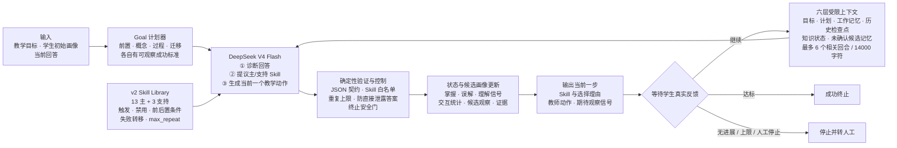

# 题目二：基于 Teaching Skill Library 的自适应教学 Agent

## 1. 问题定义与当前结论

题目二要求的不是一次性生成整段教案，而是一个实时的多轮闭环：系统收到一个教学目标和学生初始状态，只生成当前一步；学生回答后，系统重新判断状态、选择或组合 Teaching Skill，再生成下一步，直到达标或安全转人工。

当前仓库已经实现这一工程闭环。语义理解、Skill 路由建议和教师话语由 `deepseek-v4-flash` 完成；确定性控制器负责状态边界、Skill 合法性、重复上限、一次一动作和终止条件。二者共同构成 Agent，不能把它简化成“只调用一次大模型”，也不能把规则层说成另一个模型。

| 题目要求 | 当前实现 | 可验证状态 |
|---|---|---|
| 新教学目标与成功条件 | 概念、目标、材料、四维阈值、最大轮数；自动展开为 4 个可观察子目标 | 已实现并有单测 |
| 学生画像 | 教师输入基础画像；每个有效 DeepSeek 回合追加带证据的候选观察和摘要 | 已实现并有单测；候选待教师确认，不覆盖教师字段 |
| 学生当前状态 | 四维掌握、误解生命周期、当前理解信号、下一关注点、置信度、证据和交互统计 | 已实现并逐轮更新 |
| 历史对话 | 六层 `teaching_context`：固定锚点、当前计划、近期工作记忆、较早历史抽取式检查点、知识状态和未确认候选记忆 | 已实现并有预算/来源测试；不是无限或跨 session 记忆 |
| Skill 选择、组合与切换 | 13 个主 Skill 中选 1 个，可组合最多 2 个支持 Skill；每轮重新决策并公开理由 | 已实现；开放场景最优性待专家验证 |
| 实时交互 | 一次请求只消费一条学生回答，只返回一个下一教学动作 | 已实现；不是预写好多轮对话 |
| 终止 | 成功、连续无进展、最大轮数、受约束模型建议或教师 `/stop` | 已实现并有安全门 |
| 评估 | 28 例自由文本开发 benchmark、4 例结构化机制回归、学习结果记录接口 | 已实现；三类证据的含义不能混用 |

## 2. 系统整体设计



一轮的输入与输出边界如下：

```text
输入：目标 + 初始画像 + 当前显式状态 + 相关历史 + 本轮学生回答 + 可用 Skill
  ↓
DeepSeek：受约束的“诊断—路由—行动”JSON 建议
  ↓
控制器：校验、更新状态与候选画像、判断是否终止
  ↓
输出：一个主 Skill、0–2 个支持 Skill、选择理由、一个教师动作、期待信号
```

因此，“实时”在本项目中指学生每回答一次，后端才计算一次下一步；浏览器不会提前得到后续完整对话。它不表示流式摄像头或实时音视频识别。

## 3. DeepSeek 在 Agent 中具体做什么

`deepseek-v4-flash` 每轮只接收一个经过最小化和校验的 `teaching_context`，以及可用 Skill 的执行契约。该上下文把固定目标、教师画像、当前 Goal 步骤、近期对话、较早历史检查点、显式学生状态和未确认画像假设分层组织，再返回严格 JSON：

- `diagnosis`：`correct / partial / misconception / confused / no_response`，以及置信度、短证据、误解标签、回答质量、参与度和是否建议人工复核；
- `decision`：一个主 Skill、最多两个支持 Skill、选择或切换理由、下一关注维度；
- `teacher_action`：当前唯一一个解释、提示或提问，以及下一轮希望观察到的信号；
- `stop_recommendation`：是否建议停止及理由。

模型没有以下权限：新增不存在的 Skill、选择 support Skill 充当主 Skill、超过 Skill 的 `max_repeat`、重写历史、直接改变终止状态，或一次生成多轮教学。明显包含“最终答案就是……”等直接泄露模式的输出会被拒绝。

若 API、格式或校验失败，默认进入可见的确定性安全降级：非空回答保守记为 `confused`，空回答记为 `no_response`，动作标记为 `decision_origin=deterministic_safety_fallback`。这个结果不是 DeepSeek 结果；答辩时只有页面显示 `deepseek_v4_flash_constrained` 才能称该轮实际由 DeepSeek 完成。

## 4. 学生状态、候选画像与历史怎样维护

### 4.1 显式状态

系统每轮都保存至少题目要求的四类信息：

| 状态组 | 字段与含义 |
|---|---|
| 当前掌握情况 | `knowledge_mastery`：`prerequisite`、`conceptual`、`procedural`、`transfer` 四维内部控制值 |
| 误解或错误模式 | `misconceptions`：误解标签、描述、置信度、发现轮次以及 `active/resolved` 状态 |
| 当前理解信号 | `understanding_signal`、`assessment_confidence`、`assessment_evidence` |
| 下一教学重点 | `next_focus`：关注维度、理由和对应 Skill |
| 交互信号 | 尝试次数、各信号计数、滚动正确率、平均回答长度、参与度和回答质量 |

回答产生的动态信息进入可审计的 `student_state`。掌握值是控制状态，不是考试成绩，也不是经校准的真实掌握概率。

### 4.2 动态学生画像候选

教师提供的 `learner_level`、`preferences` 和 `accessibility_needs` 是基础画像，Agent 不会覆盖这些字段。每个通过 JSON、Skill 和证据校验的 DeepSeek 回合，系统会在 `student_profile.adaptive_observations` 追加一条动态候选，内容包括：

- 本轮回答质量和参与度；
- 候选误解标签与下一关注维度；
- 与本轮已脱敏回答绑定的证据摘录和诊断置信度；
- 是否需要人工复核及原因。

每条记录固定为 `status=candidate_unconfirmed`。`adaptive_summary` 汇总最新回答质量、参与度、下一重点、候选误解标签、累计/保留观察数和复核状态；最多保留最近 12 条观察，总观察数继续累计。低于运行时置信度门槛（默认 0.35）或模型主动请求复核时，会标记 `needs_human_review=true`。

只有经过约束层验证的 DeepSeek 诊断才产生候选；初始动作和 `deterministic_safety_fallback` 都不会生成。候选证据在保存前已做常见直接标识符模式替换，并必须是本轮脱敏回答的真实子串；模型伪造摘录时会回退到本轮脱敏文本。后续请求只把最近候选作为明确标记的 `candidate_unconfirmed` 低权重假设，不能当作已知事实，也不能覆盖教师画像。

这个设计实现了“随回答更新画像”，同时保留人工最终解释权：候选观察不是已确认人格或能力事实，也不会跨 session 持久化为长期画像。当前本机 Demo 结束后会话即消失。

### 4.3 Goal 模式

目标计划器把一个目标确定性地展开为 4 个可观察步骤：前置知识、概念理解、操作/推导和迁移。每一步包含目标、验证方式、成功判据和阈值；状态变化后同步更新 `active_step` 与进度。该进度用于控制教学流程，不是学习效果证据。

### 4.4 上下文管理

远程请求不会无界发送整个会话，也不再把 goal、state、history 和 profile 作为互相重叠的散装字段并列发送。唯一权威 `teaching_context` 分为六层：

1. `fixed_context`：教师输入的目标与基础画像，模型不可改写；
2. `current_plan`：当前 Goal 步骤、成功判据和上一教师动作；
3. `working_memory`：本轮回答以及最多 6 个相关回合；
4. `semantic_summary`：较早历史的确定性计数与原文抽取式 focus checkpoints，不调用模型编写摘要；
5. `knowledge_state`：四维掌握、活跃/已解决误解和未解决问题；
6. `candidate_long_term_memory`：最近的未确认画像假设，明确低权重且不可覆盖教师字段。

检索顺序仍为“同知识点优先、同关注维度其次、最近轮次最后”。未填写知识点时，使用教师输入的 `goal.concept` 作为最小真实锚点；填写多个有序知识点时，每个动作只携带文字命中或与当前掌握阶段对应的活动知识点，不再把整份目标复制到所有回合。默认总序列化硬上限为 14,000 字符，可配置为 6,000–30,000；每个快照记录实际保留轮次、字符数、截断状态和证据来源。合法超长会话会先丢弃低优先级候选、检查点和较旧回合，最终仍生成 schema-valid 的最小请求；若构建器本身异常则进入明确的规则安全降级。本轮学生回答只出现一次，证据账本保存的是指针，避免重复占用预算。

发送前会最小化画像字段，并对常见邮箱、手机号、中国身份证号、URL 和本机路径模式做替换，真实媒体不会发送。这里应称“常见直接标识符模式脱敏与上下文最小化”，不能承诺所有自由文本都已完全匿名；使用远程 API 前仍须取得授权，并避免输入不必要的个人信息。

## 5. v2 Teaching Skill Library

默认库为 `data/teacher_agent_skill_library_v2.json`，共 16 个原子 Skill：13 个主 Skill和 3 个支持 Skill。每个 Skill 都定义适用场景、禁用场景、前置与后置条件、失败转移和连续使用上限。

| 角色 | Skill | 主要用途 |
|---|---|---|
| 主 | 前置知识诊断 | 首轮或前置知识证据不足时提问诊断 |
| 主 | 问题情境建立 | 用任务情境说明为什么需要当前概念 |
| 主 | 直观例子桥接 | 困惑时先建立可感知的具体表征 |
| 主 | 直觉—概念映射 | 从例子过渡到正式概念与边界 |
| 主 | 逐步支架推导 | 把复杂过程拆成一个可回答的小步 |
| 主 | 苏格拉底理解检查 | 用追问核验理由，而非只核对结论 |
| 主 | 误解对比纠错 | 对比错误规则与正确边界，定位误解 |
| 主 | 练习—反馈—再练习 | 从支架过渡到独立操作 |
| 主 | 检索式复习 | 需要恢复前置知识或间隔回忆时使用 |
| 主 | 自我解释与反思 | 要求学生解释自己的步骤和依据 |
| 主 | 变式迁移检查 | 在准备充分后测试新情境迁移 |
| 主 | 学习者总结 | 由学生自己概括方法、边界和易错点 |
| 主 | 参与恢复与重新聚焦 | 跑题、参与度下降或持续短回答时恢复互动 |
| 支持 | 提问后等待 | 约束当前动作留出真实回答空间 |
| 支持 | 最小提示 | 只给足以推进一步的提示，避免代做 |
| 支持 | 信心支持 | 在不替代知识教学的前提下降低挫败感 |

其中 12 个 Skill 是 neural-v1 暂定执行本体的操作包装；检索式复习、自我解释、参与恢复和信心支持含有单独标记的同行评审研究补充。研究补充没有被伪装成视频观察结果。

### neural-v1 的真实边界

neural-v1 的来源是 10 讲、2 门课程，采用 grouped 5-fold OOF 开发协议；训练流程使用多模态 backbone，但公开运行 manifest 的证据物化门禁没有通过：

| 字段 | 当前值 |
|---|---:|
| 证据门禁 | `passed=false` |
| 可物化预测 | 0 |
| 被排除预测 | 54 |
| 已确认观察环节 | 0 |
| 已确认跨讲共识策略 | 0 |
| 运行用途 | `provisional_normative_execution_ontology_only` |

因此题目二确实使用 neural-v1 的九环节、十三策略本体来组织运行时 Skill，但只能称为 **provisional 执行本体**，不能称为已确认的课堂观察共识、已建立识别准确率或已证明跨课程泛化。题目一现有 v0 通用 Skill 的展示边界不因此被改写；两者是不同状态的产物。

## 6. Skill 如何选择、组合、切换和终止

每轮模型先提出决策，控制器随后执行硬校验：

1. 主 Skill 必须来自允许列表且角色不是 `support`；
2. 自动模式下，诊断信号必须落在主 Skill 的 `applicable_signals` 内；纠错 Skill 还必须绑定误解 tag；
3. 支持 Skill 去重后最多保留 2 个；
4. 当前 Skill 不能超过自己的 `max_repeat`；
5. 输出必须只有一个可响应动作，并明确等待学生；
6. 每轮记录上一 Skill、是否切换、选择理由、模型 trace 和状态证据；
7. 低置信度且建议人工复核时，状态更新会保守按 `confused` 处理；
8. 模型建议停止只有同时满足“建议人工复核 + 至少两轮无进展”才会被控制器采纳。

`preconditions`、`contraindications`、`postconditions` 与 `failure_transition` 会完整进入模型请求和审计记录，但其中的自然语言条件并非都能由规则控制器形式化证明；当前机器硬门禁只覆盖 ID/角色、适用信号、纠错证据、重复上限、单动作与停止条件。答辩时不把“字段存在”说成“所有自然语言契约均已自动验证”。

控制器还独立处理成功、连续无进展、最大轮数和教师停止。在线模式支持：

- `/+skill 名称`：强制下一轮使用指定主 Skill，并留下人工覆盖记录；
- `/auto`：恢复自动路由；
- `/stop`：不再消费学生回答，立即停止并建议人工确认。

人工覆盖不会计为 Agent 自动选择命中，也不能绕过 Skill 合法性和终止约束。

## 7. 三层评估证据

三套结果回答的是不同问题，不能合并成一个“总 Accuracy”。

### 7.1 28 例自由文本在线开发 benchmark

第三次在线运行的报告文件为 `v3`，使用 `teacher_agent_free_text_diagnose_route_v2` 提示词、`deepseek-v4-flash`、thinking disabled、temperature 0、单次重复。28 个作者构造的一轮中文案例覆盖动态规划、线性代数、Python 和概率；7 类标签各 4 例：`correct`、`partial`、`misconception`、`confused`、`no_response`、`off_topic`、`valid_alternative`。

| 指标 | DeepSeek V4 Flash | 对照 / 解释 |
|---|---:|---|
| 7 类信号 Accuracy | 0.892857 | 常量 `partial` 基线 0.142857 |
| 7 类信号 Macro-F1 | 0.875325 | 常量 `partial` 基线 0.035714 |
| 误解标签完全匹配率 | 1.000000 | 只在冻结样例定义下解释 |
| 允许主 Skill 命中率 | 0.785714 | 固定诊断 Skill 为 0.285714 |
| Skill 切换 F1 | 0.833333 | 是否应切换的开发集标签 |
| 终止 F1 | 1.000000 | 是否应终止的开发集标签 |
| 端到端调用失败率 | 0.000000 | 本次 28 次运行 |
| P50 / P95 延迟 | 1531.827 / 2384.102 ms | 本次 API 运行环境 |

Gold structured-signal oracle router 的允许 Skill 命中率为 0.964286，但它读取金标准信号，不能与端到端模型作同条件比较。

这 28 例是作者构造、未经专家复核、未在提示词开发后保持独立锁定的 **post-hoc development regression**。所以 0.892857 不能写成“真实学生诊断准确率”，0.785714 不能写成“部署路由准确率”，也不能据此证明学习效果。公开 receipt 只含聚合值和哈希，不含案例正文、供应商原始响应或密钥。

复现在线 benchmark 需要显式允许远程处理该公开 fixture：

```bash
tsm teacher-agent-benchmark \
  --online \
  --allow-remote-benchmark-data \
  --api-key-file .private/deepseek_api.txt \
  --output artifacts/private/teacher_agent_free_text_benchmark.json
```

### 7.2 4 例结构化机制回归

四条合成轨迹使用预先给定的结构化信号，比较动态 Skill Agent 与始终使用 `skill_stepwise_scaffolding` 的固定单 Skill 基线。它检验控制器是否按预期更新和切换，不检验自由文本理解。

| 指标 | 自适应 v2 Agent | 固定单 Skill |
|---|---:|---:|
| 状态轨迹一致率 | 1.000000 | — |
| 允许决策匹配率 | 0.916667 | — |
| 教学行为约束通过率 | 1.000000 | — |
| 使用多个 Skill 的案例率 | 1.000000 | 0.000000 |
| 终止决策匹配率 | 1.000000 | — |
| 内部模拟平均增益 | 37.333250 | 20.416750 |
| 内部模拟增益差 | +16.916500 | — |
| 模拟迁移通过率 | 0.750000 | 0.000000 |

前三例预期成功，第四例预期在持续无进展后安全转人工。内部模拟增益来自状态机，不是真实前后测，也不是因果学习效果。

```bash
tsm teacher-agent-evaluate \
  --library data/teacher_agent_skill_library_v2.json \
  --output artifacts/private/teacher_agent_evaluation.json
```

### 7.3 学习结果记录接口

`teacher-agent-outcome-evaluate` 接受前测、后测、可选迁移测和可选延迟测，计算绝对增益、归一化增益、迁移比例和延迟保持率。输入 provenance 必须明确是作者演示、教师提供记录还是获授权真实学习者记录。

随附 fixture 是作者构造演示：前测 2/5、后测 4/5、迁移 2/3；绝对增益 0.4、归一化增益 0.666667、迁移比例 0.666667。它只证明接口可计算，不证明系统改善了真实学生学习。

```bash
tsm teacher-agent-outcome-evaluate \
  --input data/teacher_agent_learning_outcome_demo.json \
  --output artifacts/private/teacher_agent_learning_report.json
```

## 8. 本机启动与现场演示

### 8.1 配置密钥

密钥不进入仓库。可将外置盘密钥链接到被 `.gitignore` 忽略的本机目录：

```bash
mkdir -p .private
ln -s "/path/to/deepseek_api.txt" .private/deepseek_api.txt
```

也可以不建立链接，启动前设置 `DEEPSEEK_API_KEY_FILE` 指向自己的密钥文件。密钥只由本机服务读取，不进入页面和公开运行日志。

### 8.2 启动

macOS 直接双击根目录的 `打开题目二教学Agent.command`。等价命令为：

```bash
tsm teacher-agent-dashboard \
  --agent-backend deepseek \
  --model deepseek-v4-flash \
  --api-key-file .private/deepseek_api.txt \
  --allow-remote-student-data
```

离线自检和无 API 的规则基线分别为：

```bash
tsm teacher-agent-dashboard --check
tsm teacher-agent-dashboard --agent-backend deterministic
```

页面只绑定 `127.0.0.1`，使用随机 capability URL、CSP 和 `Cache-Control: no-store`，单个会话只保存在服务内存。页面本地运行不等于全部处理离线：在线模式会把最小化并做常见直接标识符模式替换后的文本发送给配置的 DeepSeek API。网页采用“左侧目标与阶段—中间学习对话—右侧状态与记忆检查器”的学习工作台；论文评估被放在单独视图，不与学生输入混在一起。同一 step 还会校验会话、预期轮次和幂等键，网络重试不会把一次回答计成两轮。

### 8.3 3—5 分钟答辩脚本

1. 输入一个新的教学概念、目标和四维初始状态，点击开始；指出系统只输出第一个动作。
2. 指向 Goal 计划、当前主/支持 Skill、选择理由和 `decision_origin`；确认本轮确实为 DeepSeek。
3. 输入一句包含明确错误规则的回答，提交；展示误解证据、状态更新以及 Skill 切换到纠错或理解检查。
4. 输入纠正后的回答；展示误解从 `active` 变为 `resolved`，下一关注点继续变化。
5. 用 `/+skill 名称` 展示一次人工覆盖，再用 `/auto` 恢复自动路由；说明覆盖有审计标记。
6. 展示 28 例开发 benchmark、固定单 Skill 对照和学习结果接口；主动说明它们分别是自由文本开发证据、机制回归和指标计算演示。
7. 若时间允许，用连续无进展回答或 `/stop` 展示安全转人工，而不是无限生成。

## 9. 交付物映射

| 类别 | 文件或入口 |
|---|---|
| 确定性状态机与结构化回归 | `teaching_skill_miner/teacher_agent.py` |
| DeepSeek 客户端 | `teaching_skill_miner/deepseek_client.py` |
| 自然语言实时 Agent | `teaching_skill_miner/teacher_agent_live.py` |
| Goal 与历史上下文 | `teaching_skill_miner/teacher_agent_context.py` |
| 本机服务与网页 | `teaching_skill_miner/teacher_agent_dashboard.py`、`teaching_skill_miner/web/teacher_agent_demo.*` |
| v2 Skill Library | `data/teacher_agent_skill_library_v2.json` |
| neural-v1 运行边界 | `data/neural_v1_runtime_manifest.json` |
| 28 例 benchmark 与公开 receipt | `data/teacher_agent_free_text_benchmark.json`、`data/teacher_agent_free_text_benchmark_receipt.json` |
| 4 例结构化回归 | `data/teacher_agent_evaluation_cases.json` |
| 学习结果接口与 fixture | `teaching_skill_miner/teacher_agent_outcomes.py`、`data/teacher_agent_learning_outcome_demo.json` |
| Schema | `schema/teacher_agent_*.schema.json`、`schema/neural_v1_runtime_manifest.schema.json` |
| 自动测试 | `tests/test_deepseek_client.py`、`tests/test_teacher_agent*.py` |
| 研究依据与后续协议 | `docs/teacher_agent_references.md` |

## 10. 当前可以说什么，不能说什么

可以说：

> 本项目实现了以 DeepSeek V4 Flash 为语义和生成骨干、以显式状态与确定性约束为控制层的实时多轮教学 Agent。它在每个真实请求—响应轮次中诊断一条学生回答，更新学生状态与待确认候选画像，从 v2 的 13 个主 Skill 和 3 个支持 Skill 中选择、组合或切换，生成一个下一教学动作，并在成功、无进展或人工停止时终止。

必须同时补充：

- neural-v1 的运行本体仍为 provisional，证据物化门禁未通过；
- 28 例结果只是在作者构造且 post-hoc 的开发集上的单轮结果；
- 4 例结果只证明结构化控制机制按 fixture 工作；
- 学习结果 fixture 只证明评估接口存在；
- 自由文本诊断、专家教学质量、真实学习效果、跨 session 泛化和部署质量仍需独立、预注册或锁箱的外部验证。

完整验收口径见 [`teacher_agent_acceptance_matrix.md`](teacher_agent_acceptance_matrix.md)，研究参考与后续实验设计见 [`teacher_agent_references.md`](teacher_agent_references.md)。
